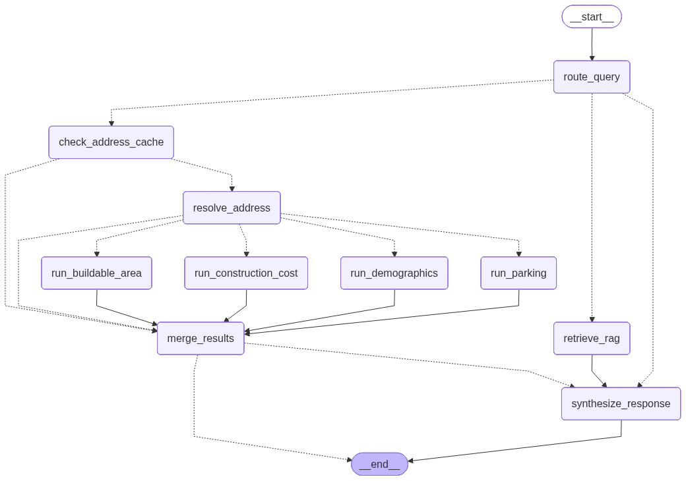

# 🏗️ Berlin Zoning Assistant

An AI agent for architects, developers, and planners who need faster answers about Berlin zoning, building rules, and planning constraints. Enter a Berlin address to generate a structured zoning report with parcel context, buildability estimates, parking requirements, construction cost estimates, demographics, and regulation-grounded explanations.




## Setup

### Prerequisites

Python 3.11 is recommended.

Install `uv` first if you do not already have it:

```bash
curl -LsSf https://astral.sh/uv/install.sh | sh
```

Restart your shell if needed, then verify:

```bash
uv --version
```

### Create the virtual environment

```bash
uv venv --python 3.11
source .venv/bin/activate
```

### Install dependencies

If the project uses `requirements.txt`:

```bash
uv pip install -r requirements.txt
```

If you later migrate the project to `pyproject.toml`, prefer:

```bash
uv sync
```

### Environment variables

Create a `.env` file in the project root:

```env
ANTHROPIC_API_KEY=your-key
OPENAI_API_KEY=your-key
VOYAGE_API_KEY=your-key
APP_PASSWORD=your-password
```

### Run the app

```bash
streamlit run app.py
```

### First run behavior

On first run, the app creates the local ChromaDB vector store and the SQLite memory database if they do not already exist. After that, subsequent runs reuse them from disk.

---
## What it does

The assistant supports two main workflows:

### 1. Address-based zoning analysis
Enter a Berlin address and the agent will:

1. Geocode the address and fetch parcel / planning context from Berlin geodata services
2. Determine the zoning context and plot area when available
3. Run parallel calculation nodes for:
   - buildable area
   - parking requirements
   - construction cost estimate
   - district demographics
4. Merge all tool outputs into a structured zoning report
5. Optionally synthesize a natural-language response grounded in retrieved regulation text

### 2. Regulation and planning questions
For questions such as:

- “What are the setback rules in an MI zone?”
- “How is GRZ different from GFZ?”
- “When are bicycle parking spaces required in Berlin?”

…the assistant can answer directly from its RAG knowledge base without resolving an address first.

---

## Why this project matters

Berlin planning workflows are fragmented across multiple sources: zoning categories, cadastral data, state building code, federal land-use regulations, parking rules, and district-level context. A single practical question such as **“What can I build here?”** often requires combining live geodata with regulation lookup and domain-specific calculations.

This project turns that multi-step workflow into a single AI-assisted interaction.

---

## Sprint 3 highlights

This version moves beyond a single-tool agent and introduces a more explicit orchestration layer:

- **LangGraph `StateGraph` architecture** instead of a monolithic agent flow
- **Parallel tool execution** after address resolution
- **HITL interrupts** for ambiguous or incomplete address queries in chat mode
- **SQLite-backed memory** for persistence and repeat-query acceleration
- **Quick Report form mode** for structured address input
- **Multi-LLM support** with Anthropic and OpenAI providers

---


## Optional tasks completed

The project already implements several optional Sprint 3 upgrades.

| Task | Difficulty | How it was applied |
|---|---|---|
| Interactive help feature | Easy | The welcome screen includes example prompts to guide users toward valid questions and show what the assistant can do. |
| Choose from a list of LLMs | Easy | The UI includes provider selection so the app can run with different model backends instead of a single fixed model path. |
| Token usage and cost display | Medium | The app tracks token usage in state and surfaces cost-tracking information in the UI. |
| Retry logic | Medium | Address resolution includes retry handling for transient failures before returning an error or triggering clarification. |
| Long-term / short-term memory | Medium | SQLite-backed graph memory persists conversation state across turns and sessions. |
| Extra function tools / external APIs | Medium | The agent uses multiple tools for buildable area, parking, construction cost, demographics, and live Berlin geodata lookups. |
| Caching mechanism | Medium | A custom SQLite address cache reuses previous lookup results to speed up repeated queries and reduce unnecessary API calls. |
| Multi-model support | Medium | The architecture supports multiple LLM providers through a shared LLM factory and provider selection in the UI. |
| Agentic RAG | Hard | Regulation questions are routed into a retrieval step that pulls relevant planning documents and grounds the final answer in retrieved context. |
| LLM observability | Hard | LangSmith support is included for tracing and debugging graph runs. |
| External data source integration | Hard | The agent combines local regulation documents with external geodata, cadastral, geocoding, and statistics sources. |
| Cloud deployment | Hard | The app is prepared for and deployed on Streamlit Cloud. |

---
## Memory and caching

The app includes memory specifically to reduce repeated work and improve follow-up interactions.

### 1. Conversation memory
A SQLite checkpointer stores graph state across turns, so the assistant can continue the same thread without rebuilding context every time.

### 2. Address cache
Repeated address lookups are accelerated through a custom SQLite address cache:

- exact normalized match first
- then fuzzy prefix matching
- ambiguity detection when necessary

On a cache hit, the agent can reuse previously resolved address/tool results instead of calling the external APIs again. This saves time, reduces unnecessary requests, and makes repeated queries much faster.

---

## Tech stack

| Layer | Technology |
|---|---|
| Language | Python 3.11 |
| UI | Streamlit |
| Orchestration | LangGraph |
| LLMs | Anthropic Claude Sonnet / OpenAI GPT models |
| RAG framework | LangChain |
| Embeddings | Voyage AI (`voyage-law-2`) |
| Vector store | ChromaDB |
| Memory | SQLite (`memory.db`) |
| Geodata | Berlin geodata / cadastral APIs + geocoding |

---

## Graph architecture

The workflow is organized as a directed graph with separate routing, retrieval, resolution, tool, merge, and synthesis nodes.

### High-level flow

- `route_query`
  - decides whether the query is:
	- regulation
	- address
	- direct
- `retrieve_rag`
  - retrieves regulation excerpts for non-address knowledge questions
- `check_address_cache`
  - attempts to reuse previously resolved address data
- `resolve_address`
  - geocodes the address and fetches zoning / plot context
- parallel execution:
  - `run_buildable_area`
  - `run_construction_cost`
  - `run_demographics`
  - `run_parking`
- `merge_results`
  - assembles the final zoning report
- `synthesize_response`
  - produces the final user-facing response when needed

### Included graph image
The diagram above reflects the current node structure used in Sprint 3.

---

## Main capabilities

| Capability | Description |
|---|---|
| Address resolution | Geocodes Berlin addresses and resolves zoning context |
| Buildable area estimation | Uses zoning parameters such as GRZ / GFZ where applicable |
| Parking analysis | Estimates required parking-related outputs from Berlin rules |
| Construction cost estimate | Produces rough cost estimates based on building type assumptions |
| Demographics | Adds district-level demographic context |
| RAG answers | Retrieves regulation text from the knowledge base for grounded responses |
| Memory | Persists thread state and speeds up repeated address queries |

---

## Knowledge base

The assistant uses a local RAG pipeline over planning and regulation documents stored in `data/docs/`.

Typical sources include documents such as:

- BauNVO
- BauO Berlin
- AV Stellplätze
- other project-specific regulation PDFs / texts

The vector store is built locally and persisted in `chroma_db/`.

---

## Project structure

```text
berlin-zoning-assistant/
├── app.py
├── config.py
├── requirements.txt
├── memory.db                  # auto-created at runtime
├── chroma_db/                 # auto-created vector store
│
├── chain/
│   ├── state.py
│   ├── graph.py
│   ├── nodes.py
│   ├── agent.py
│   ├── memory.py
│   ├── llm.py
│   └── prompts.py
│
├── tools/
│   ├── buildable_area.py
│   ├── parking.py
│   ├── construction_cost.py
│   ├── demographics.py
│   ├── fisbroker.py
│   └── zoning_report.py       # legacy / retained for reference
│
├── rag/
│   ├── embeddings.py
│   ├── loader.py
│   └── retriever.py
│
├── data/
│   ├── docs/
│   └── zoning_rules.py
│
└── ui/
	├── app.py
	├── chat.py
	├── sidebar.py
	├── components.py
	├── cards.py
	├── strings.py
	└── rate_limiter.py
```

---